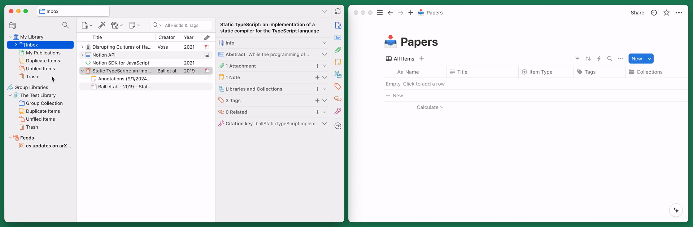
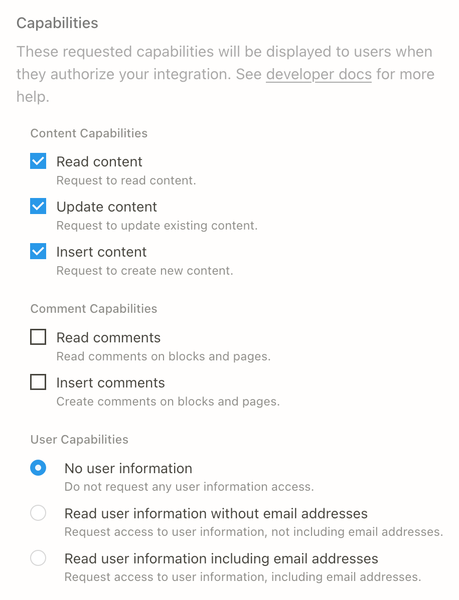
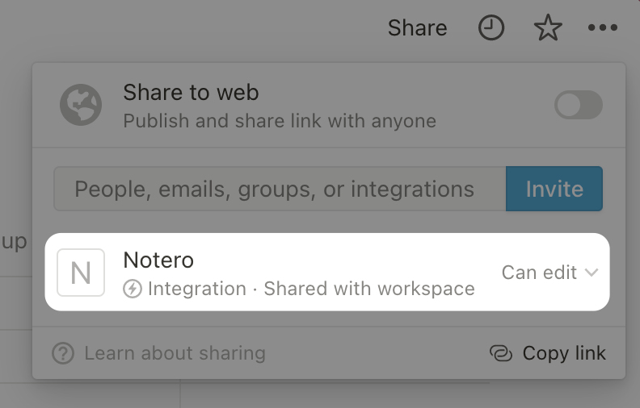

# Notero

Notero is a [Zotero plugin](https://www.zotero.org/support/plugins) for syncing
items and notes into [Notion](https://www.notion.so/product). To use it:

1. 📔 [Configure](#configure-notion) your Notion database.
2. 💾 [Install](#install-and-configure-notero-plugin) the Notero plugin into Zotero.
3. 📁 Choose your Zotero collections to monitor.
4. 📝 Add or update items in your collections.
5. 🔄 Watch your items sync into Notion!

Concept by [@arhoff](https://github.com/arhoff) 👩🏻‍🔬 |
Built with ❤️ by [@dvanoni](https://github.com/dvanoni)

## Table of Contents

- [Why Use Notero?](#why-use-notero)
- [How Notero Works](#how-notero-works)
- [Installation and Setup](#installation-and-setup)
- [Usage Guides](#usage-guides)
- [Frequently Asked Questions](#frequently-asked-questions)
- [Example Notion Databases](#example-notion-databases)
- [Development](#development)

## Why Use Notero?

- Integrate your reference manager, task list, reading notes, analytical tables,
  and drafts in one location.
- Easily link to references when writing in Notion.
- Create custom views to filter and sort large reference lists by project,
  tag, author, etc.
- Backlinks make it easy to locate any of the notes and drafts that mention
  a reference.
- Link references to entries in other databases, such as projects, tasks,
  manuscripts in your publication pipeline, publishing outlets, etc.

## How Notero Works

The Notero plugin watches for Zotero items being added to or modified within
any collections that you specify in the Notero preferences. Whenever an item
is added or modified, Notero does a few things:

- Save a page with the Zotero item's properties (title, authors, etc.) into the
  Notion database specified in Notero preferences.
- Add a `notion` tag to the Zotero item.
- Add an attachment to the Zotero item that links to the page in Notion.

In addition to providing a convenient way to open a Notion page from Zotero,
the link attachment also serves as a reference for Notero so that it can update
the corresponding Notion page for a given Zotero item.

### Syncing Items

By default, Notero will sync items in your monitored collections whenever they
are modified. You can disable this functionality by unchecking the **Sync when
items are modified** option in the Notero preferences.

You can also sync items from the collection or item context menus (right-click):

- To sync all items in a collection, open the context menu for the collection
  and select **Sync Items to Notion**.
- To sync one item or multiple items, select the item(s) in the main pane, open
  the context menu, and select **Sync to Notion**.

> [!NOTE]
> To prevent the "sync on modify" functionality from saving to Notion multiple
> times, Notero does not notify Zotero when the tag and link attachment are
> added to an item. This means they may not appear in Zotero immediately, and
> you may need to navigate to a different item and back to make them appear.

### Syncing Notes and PDF Annotations

Zotero notes associated with an item can be synced into Notion as content of the
corresponding page for that item. As with regular items, you can manually sync
notes using the **Sync to Notion** option in the context menu.

Automatic syncing of notes can be enabled via the **Sync notes** option in the
Notero preferences. When enabled, notes will automatically sync whenever they
are modified. Additionally, when a regular item is synced, all of its notes will
also sync if they have not already.

To sync annotations (notes and highlights) from a PDF, you'll first need to
extract them into a Zotero note:

1. Select an item or PDF, open the context menu, and select
   **Add Note from Annotations**.
2. If desired, enable highlight colors from the menu at the top-right of the
   note panel.

  
Example of creating a note from PDF annotations

  <video src="https://github.com/dvanoni/notero/assets/299357/4cda5dc7-ba5b-4f5a-8f53-d6bc2c44b1dc" />

## Installation and Setup

The [latest release](https://github.com/dvanoni/notero/releases/latest) of the
plugin is available on GitHub.
See the [changelog](CHANGELOG.md) for release notes.

Detailed setup instructions are below.

### Configure Notion

1.  Create the Notion database that you would like to sync Zotero items into.

    See [examples](#example-notion-databases) below that you can duplicate into
    your Notion workspace.

2.  Create a Notion [internal integration](https://developers.notion.com/docs/create-a-notion-integration)
    at https://www.notion.com/my-integrations and enable _all_ of the
    "content capabilities."

    

      
Example of integration capabilities settings

      
    

3.  Take note of the "internal integration secret" from the previous step.

4.  Give your integration access to your database.

    From the [Notion developer docs](https://developers.notion.com/docs/create-a-notion-integration#give-your-integration-page-permissions):

    > 1. Go to the database page in your workspace.
    > 2. Click on the **•••** More menu in the top-right corner of the page.
    > 3. Scroll down to and click **+ Add Connections**.
    > 4. Search for and select your integration in the **Search for connections...** menu.

      

        
Example of connection settings from the Notion documentation

        
      

5.  Take note of the database ID.

    To get the database ID, copy the URL of your Notion database. If you're
    using an inline database, then make sure you're viewing the database as a
    full page. If you're using the Notion desktop app, then click **Share**
    and select **Copy link** to find the database URL.

    The database ID is the string of characters in the database URL that is
    between the slash following your workspace name (if you named it) and the
    question mark. The ID is 32 characters long, containing numbers and letters.

    

6.  Configure the database properties as desired. See the
    [database properties](#notion-database-properties) section below for more details.

#### Notion Database Properties

Notero can sync data for the properties listed below. The only property required
by Notero is one with the **Title** property type. The other properties are
optional, so you can use only the ones that suit your needs.

The **Title** property can be named something other than `Name` as long as it
does not conflict with any of the other property names. The name and type of
the other properties must be configured exactly as specified here. Note that
property names are case-sensitive, so the capitalization must match exactly.

Support for customizing properties is planned for the future;
see issue [#355](https://github.com/dvanoni/notero/issues/355).

| Property Name       | Property Type | Notes                                                                             |
| ------------------- | ------------- | --------------------------------------------------------------------------------- |
| `Name`              | Title         | Format configurable via the **Notion Page Title** option in Notero preferences    |
| `Abstract`          | Text          |                                                                                   |
| `Authors`           | Text          |                                                                                   |
| `Citation Key`      | Text          | Requires [Better BibTeX](https://retorque.re/zotero-better-bibtex/)               |
| `Collections`       | Multi-select  |                                                                                   |
| `Date`              | Text          |                                                                                   |
| `Date Added`        | Date          |                                                                                   |
| `Date Modified`     | Date          |                                                                                   |
| `DOI`               | URL           |                                                                                   |
| `Editors`           | Text          |                                                                                   |
| `Extra`             | Text          |                                                                                   |
| `File Path`         | Text          |                                                                                   |
| `Full Citation`     | Text          | Format based on the Zotero setting for **Export → Quick Copy → Item Format**      |
| `In-Text Citation`  | Text          | Format based on the Zotero setting for **Export → Quick Copy → Item Format**      |
| `Item Type`         | Select        |                                                                                   |
| `Place`             | Text          |                                                                                   |
| `Proceedings Title` | Text          |                                                                                   |
| `Publication`       | Text          |                                                                                   |
| `Series Title`      | Text          |                                                                                   |
| `Short Title`       | Text          |                                                                                   |
| `Tags`              | Multi-select  |                                                                                   |
| `Title`             | Text          |                                                                                   |
| `URL`               | URL           |                                                                                   |
| `Year`              | Number        |                                                                                   |
| `Zotero URI`        | URL           | Links do not work; see issue [#172](https://github.com/dvanoni/notero/issues/172) |

### Install and Configure Notero Plugin

1. Download the [latest version](https://github.com/dvanoni/notero/releases/latest)
   of the `.xpi` file.
   - Note for Firefox users: You'll need to right-click the `.xpi` file link and
     choose **Save Link As...** in order to properly download the file.
2. Open the Zotero Add-ons Manager via the **Tools → Add-ons** menu item.
3. Install the `.xpi` file by either:
   - dragging and dropping it into the Add-ons Manager window _or_
   - selecting it using the **Install Add-on From File...** option in the
     gear menu in the top-right corner of the window
4. Restart Zotero to activate the plugin.
5. Open the Notero preferences from the **Tools → Notero Preferences...** menu
   item, and enter the required preferences.
   - Note for Zotero 7 users: The Notero preferences have moved into a section
     in the main Zotero preferences window.

## Usage Guides

For more visual guides of setting up and using Notero, see the following
resources made by wonderful members of the community:

- [Using Notion and Zotero to build a literature tracker](https://sciquest.netlify.app/posts/notion_literature/)
  (blog post) by [Jewel Johnson](https://jeweljohnsonj.github.io/jewel_resume/)
- [How To Sync Zotero → Notion // Research Paper Workflow (2023 Tutorial)](https://youtu.be/8RFFxFcrLCo)
  (video) by [Holly Jane](https://hollyjane.org/)
- [Smart notetaking by starting with integrating Zotero and Notion: A first step](https://youtu.be/4Z_5tskdNsY?t=1173)
  (video) by [Dr. Jingjing Lin](https://jingjing-lin.com/)

_If you'd like to share how you use Notero and want to be listed here, please
feel free to submit a PR or [contact me](https://github.com/dvanoni)!_

## Frequently Asked Questions

### How to sync from Notion back into Zotero

While this would be nice, it's unfortunately beyond the scope of this plugin.
Getting updates from Notion into Zotero would require setting up a hosted
service that subscribes to webhooks from Notion and then uses the Zotero API to
update items in Zotero. Notion has yet to release official webhook support, but
there are some third-party tools that can be used for this. In theory, this is
technically possible, but it would be a separate project.

### How to sync attached files into Notion

There currently isn't a good way to sync files or link to local files due to the
following limitations with Notion:

- The Notion API [does not currently support uploading files](https://developers.notion.com/reference/file-object#externally-hosted-files-vs-files-hosted-by-notion).
- Notion only supports `http:` and `https:` URLs, so it's not possible to link
  directly to the file using a `file:` URL.

For now, the best workarounds are:

- Use the `File Path` property to point you to the location of the local file.
- If you sync your files into your Zotero account, you can open the Zotero web
  interface from the `Zotero URI` property and then open the file from there.

### How to bulk sync existing items

To sync multiple items that are already in a monitored collection, you can do so
from the collection or item context menus.
See the [Syncing Items](#syncing-items) section above.

### How to fix Notion API errors

#### Invalid request URL

If you receive the following error:

> APIResponseError: Invalid request URL.

This usually occurs when there's something amiss with the database ID entered in
the Notero preferences. Double check that the database ID follows the format
described in the [Configure Notion](#configure-notion) section. It should be 32
characters consisting of only numbers and letters.

#### Could not find database

If you receive the following error:

> APIResponseError: Could not find database with ID: _xxxxxxxx-xxxx-xxxx-xxxx-xxxxxxxxxxxx_

This most likely means you have not given Notero access to your Notion database.
Ensure you follow all the steps from the [Configure Notion](#configure-notion)
section. Clicking the **•••** button in the top-right corner of your database
should show a connection for the integration you've created for Notero.

  
Example of connection settings

  

#### Can't update a page that is archived

If you receive the following error:

> APIResponseError: Can't update a page that is archived. You must unarchive the
> page before updating.

This can happen when Notero tries to sync an item that already had a Notion page
created for it from a previous sync, but that page has since been deleted.
(Note that deleting a Notion page moves it into the trash, and the Notion API
refers to this as "archived.")

As described in the [How Notero Works](#how-notero-works) section, Notero
associates Zotero items with Notion pages through a link named `Notion` attached
to the item. To resolve the issue, delete this link attachment on the offending
item(s) and then perform the sync again.

#### Not a property that exists

If you receive the following error:

> APIResponseError: _property_ is not a property that exists

This can happen if you previously synced items into one Notion database and then
change your Notero preferences to specify a different database. Notero may be
trying to update pages in the old database instead of creating pages in the new
database, and this error can occur if different properties were configured in
the different databases.

To solve this, you should delete the old database in Notion and then permanently
delete it from the Trash in Notion.

## Example Notion Databases

We provide some example Notion databases that have been configured with all the
properties synced by Notero.

Once you've opened one of the examples, click the **Duplicate** button in the
top-right corner of the page to duplicate it into your Notion workspace.

### [Basic Example](https://dvanoni.notion.site/5ba9956716ac4218be77d2b4655911f5)

An empty database that contains only the properties synced by Notero.
Useful if you want to start from scratch and customize it yourself.

### [Advanced Example](https://dvanoni.notion.site/79b17005bc374209b0f373b1a3cde0ae)

A database with multiple views and some sample entries.
See below for descriptions of how you can use the different views.

#### Bibliographic Info Table View

- Table view enables easy editing of entries.
- Easily navigate to the original source by clicking on the `DOI` or `URL` property.
  - DOIs for books may need to be copy & pasted manually from the `Extra`
    field in Zotero.
- Click on the `Zotero URI` property to view/edit the entry in Zotero or to
  export the bibliography entry in a different citation style.

#### Reading Status Board View

- Keep track of promising references you need to locate, books and articles you
  requested via interlibrary loan, and works that are relevant enough to warrant
  taking in-depth notes or writing a memo.

#### Literature Review Table View

- Quickly analyze and compare attributes of literature you are reviewing
  (e.g., theoretical framework, sample, methods used, key findings, etc.)
- Easily link to other works using the `Related References` property
  (e.g., articles in the same special issue, book chapters in the same edited
  book, studies and commentary that respond to or extend other works).

#### Books Gallery View

- Add a cover image (e.g., right click → copy image address from Amazon).
- Keep track of which books you own, borrow, and lend to others.
  - Add due dates and reminders for library books and interlibrary loans.

## Development

Notero was scaffolded with [generator-zotero-plugin][generator-zotero-plugin]
and uses build scripts heavily inspired by [zotero-plugin][zotero-plugin].
Many thanks to [@retorquere](https://github.com/retorquere) for creating these.

### Local Setup

The steps below are based on the [Zotero Plugin Development][plugin-development]
documentation and should allow you to build and run Notero yourself.

1.  To avoid any potential damage to your default Zotero profile, you can
    [create a new profile][zotero-profiles] for development purposes.

2.  Create a file named `zotero.config.json` that will contain the config
    options used to start Zotero.
    See [`zotero.config.example.json`](zotero.config.example.json) for an
    example file that has descriptions of all available config options.

3.  Install dependencies:

        npm ci

4.  Build Notero and start Zotero with the plugin installed:

        npm start

    Alternatively, you can start your desired beta version of Zotero:

        npm run start-beta

    The `start` script performs a number of steps:

    1.  Execute `npm run build` to build the plugin into the `build` directory.
    2.  If defined, run the `scripts.prestart` command specified in
        `zotero.config.json`.
    3.  Write a file containing the absolute path to the `build` directory into
        the `extensions` directory in the Zotero profile directory.
    4.  Remove the `extensions.lastAppBuildId` and `extensions.lastAppVersion`
        lines from `prefs.js` in the Zotero profile directory.
    5.  Start Zotero with the profile specified in `zotero.config.json` and the
        following command line arguments:

            -purgecaches -ZoteroDebugText -jsconsole -debugger -datadir profile

    6.  If defined, run the `scripts.poststart` command specified in
        `zotero.config.json`.

[generator-zotero-plugin]: https://github.com/retorquere/generator-zotero-plugin
[zotero-plugin]: https://github.com/retorquere/zotero-plugin
[plugin-development]: https://www.zotero.org/support/dev/client_coding/plugin_development
[zotero-profiles]: https://www.zotero.org/support/kb/multiple_profiles

### Releasing a New Version

1.  Run the `version` script (not to be confused with `npm version`) to run
    [`standard-version`](https://github.com/conventional-changelog/standard-version).
    This will create a new commit with a bumped package version and updated
    changelog, and then it will create a version tag on the commit.

        npm run version

2.  Push the new version to GitHub:

        git push --follow-tags

3.  GitHub Actions will run the [`release`](.github/workflows/release.yml)
    workflow upon push of a version tag. This workflow will build the `.xpi`
    file and then create a GitHub release with the `.xpi` file.
